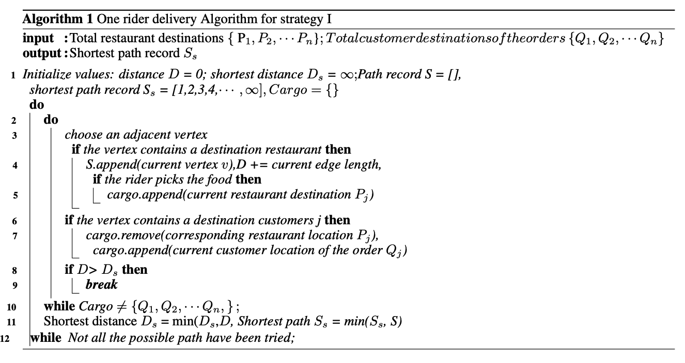

# Optimal food delivery Modeling

**by Chenglin Zhang, Mengfan Gong, Yijia Xue**

names by the alphabetical order of the last names

## Problem Introduction

It is crucial to investigate the optimal pick-up and delivery strategy for the delivery-food riders given the boom of the delivery-food market. Higher delivery efficiency will not only benefit the food delivery company but also the customers. For the companies, they can achieve higher revenue with the same amount of resources if they utilize a better taking and delivery strategy. On the customers’ side, they can get their food faster, which is also an improvement of their overall well-being

In this problem, we investigate the food delivery market in a specific region of Yushan Town, Kunshan City. Particularly, we are asked to construct an optimal pick-up and delivery strategy model for the 100 delivery-food riders P1, P2, · · · , P100 in the closed region in the given time interval from 11:00 AM to 2:00 PM so that the revenue is maximized. It is a typical routing problem that involves the **Graph Theory** and **Dynamic Programming** algorithms related to **the Shortest Path Problem**.

## Model

More precisely, we first construct a **weighted undirected cyclic graph** V, E with 120 vertices Vi (1 = 1, 2, · · · , 120) and a bunch of edges E connecting the vertices as a representation of Yushan Town. 40 vertices are randomly selected as restaurants that can generate orders R1, R2, · · · , Rn, in which n is the total number of orders that are generated in the given time interval. 40 other vertices are also randomly selected as communities that can generate delivery destinations where customers can get their food. The destinations C1, C2, · · · , Cn are matched with the orders Ri . For example, order R35 generated in the vertex number 12 should be delivered to destination C35 generated in the vertex number 48.

We first used the **Enumerate Method** to list the possible paths and find the optimal of it, while also used **prune method** to decrease the computation complexity. We then used the **Floyd-Warshall Algorithm** to compute the **All-Pair-Shortest-Path (APSP)**  and then used it to get the distance of different choices of paths. Then, we introduced the **Permutation of paths** so that the rider can pick one of them which distance is the shortest and traverse it. We also introduced the credit score si (i = 1, 2, · · · , 10) ranging from 0 to 10 for each delivery food rider, that failure to deliver the order in 45 minutes will cause a 1-point-deduction in the credit score and will have negative impact on the riders.

Then, we employed the **Monte Carlo simulation** to test the performance of the last two different pick-up and delivery strategies, as well as the situation of weather changes and get the statistics. We find that for strategy II, the mean number of finished orders in the three hours from 11:00 am to 2:00 pm is about 1315, while for strategy III, the mean number is about 1380. For strategy III, the number of canceled orders and average order delivery time also decreases.

Further, we proposed that our model can be optimized in the assigning algorithms of the orders, and also by taking more factors into account.